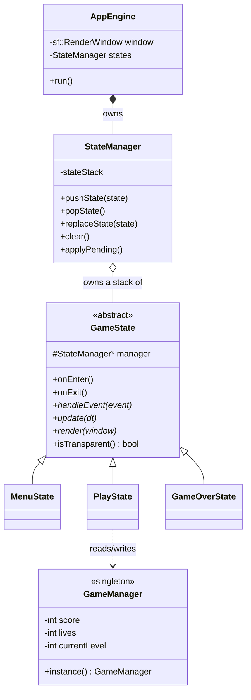
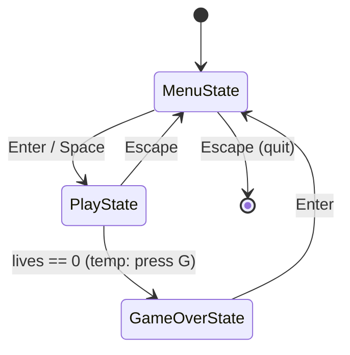

# Core Engine Design Report

> **Issue 1 — Game Loop & State Manager.** This document describes the runtime scaffold
> that the rest of the game is built on. If you are working on Issue 2, 3, 4, or 5, read
> **[Section 6 — How to Extend](#6-how-to-extend-integration-recipes)**: it shows exactly
> where your code plugs in.

---

## 1. Purpose & Audience

This subsystem is the **engine core**: it opens the window, runs the main game loop, and
switches between screens (menu, gameplay, game over). It does *not* contain gameplay,
graphics assets, physics, or level data — those are provided by the other four issues and
attach to the seams described here.

It follows the project's **MVC** split:

- **`controller::`** — drives everything: the loop and the game states (`AppEngine`,
  `StateManager`, `GameState` and its subclasses).
- **`model::`** — holds data: `GameManager` (score/lives/level), plus the existing
  `TileMap`, `Entity`, etc.
- **`view::`** — draws: the existing `TileMapRenderer`, and (Issue 2) the asset/render
  helpers.

The design goal is a **stable contract**: teammates code against these interfaces without
needing to read the engine internals.

---

## 2. Architecture at a Glance



| Component | Responsibility |
|-----------|----------------|
| `AppEngine` | Owns the window + state stack; runs the fixed-timestep loop. |
| `StateManager` | Owns the stack of states; routes input/update/render; applies transitions. |
| `GameState` | Abstract base for every screen (the State Pattern). |
| `MenuState` / `PlayState` / `GameOverState` | The three concrete screens. |
| `GameManager` | Global singleton holding score, lives, and current level. |

---

## 3. The Game Loop (`AppEngine`)

`AppEngine` owns the **single** `sf::RenderWindow` and runs one loop per frame in this
order: **process input → update (fixed step) → render → apply transitions**.

```cpp
void AppEngine::run() {
    sf::Clock clock;
    float accumulator = 0.0f;

    while (window.isOpen() && !states.empty()) {
        accumulator += std::min(clock.restart().asSeconds(), MaxFrameTime);

        processInput();                          // pollEvent -> states.handleEvent

        while (accumulator >= TimeStep) {        // fixed-step catch-up
            update(TimeStep);                    // states.update(1/60)
            accumulator -= TimeStep;
        }

        render();                                // states.render(window) -> window.display()
        states.applyPending();                   // enact queued transitions
    }
}
```

**Why fixed-timestep?** Physics/update always advances in constant `1/60 s` slices,
independent of framerate. This keeps collision (Issue 3) **deterministic** and prevents
fast objects from **tunnelling** through walls. Rendering still runs once per frame.

Key constants:

- `TimeStep = 1.0f / 60.0f` (in `AppEngine.h`) — the fixed update step.
- `MaxFrameTime = 0.25f` (in `AppEngine.cpp`) — caps a single frame's elapsed time so a stall (e.g. dragging
  the window) can't trigger a huge burst of catch-up updates (the "spiral of death").

The loop ends when the window closes **or** the state stack becomes empty.

---

## 4. The State System (State Pattern)

### 4.1 `GameState` — the interface every screen implements

```cpp
class GameState {
public:
    virtual ~GameState() = default;
    virtual void onEnter() {}                                 // called when pushed
    virtual void onExit()  {}                                 // called when removed
    virtual void handleEvent(const sf::Event& event) = 0;     // one input event
    virtual void update(float deltaTime)             = 0;     // fixed-step logic
    virtual void render(sf::RenderWindow& window)    = 0;     // draw this screen
    virtual bool isTransparent() const { return false; }      // overlay support
protected:
    StateManager* manager = nullptr;   // back-pointer to request transitions
};
```

`manager` is set automatically by the `StateManager` when the state is pushed. Use it from
inside a state to request a transition (see [Recipe B](#b-trigger-a-transition-from-inside-a-state)).

### 4.2 `StateManager` — the stack

States live in a **stack** (`std::vector<std::unique_ptr<GameState>>`). The top of the
stack is the active state.

| Method | Effect |
|--------|--------|
| `pushState(state)` | Add a state on top (previous one stays underneath). |
| `popState()` | Remove the top state. |
| `replaceState(state)` | Pop the top, then push the new one (a normal screen switch). |
| `clear()` | Remove all states (empties the stack → loop exits). |
| `empty()` | True when no states remain. |

- **Input & update** go to the **top** state only.
- **Render** walks from the lowest *non-hidden* state upward, so an overlay can draw on
  top of the screen beneath it.

### 4.3 Deferred transitions — why `applyPending()` exists

`pushState` / `popState` / `replaceState` / `clear` do **not** change the stack
immediately — they **queue** the change. `AppEngine` calls `states.applyPending()` once at
the end of each frame to enact them.

This means a state can safely call `manager->replaceState(...)` **from inside its own
`update()`** — the object isn't destroyed while it's still running, and the stack is never
mutated while it's being iterated. `onExit()` (old state) and `onEnter()` (new state) fire
at apply time.

### 4.4 Overlays

`isTransparent()` returning `true` tells the renderer to also draw the state directly
below. This is how a future **`PauseState`** can be pushed over a frozen `PlayState`:
gameplay keeps rendering underneath, but only the pause menu receives input.

### 4.5 State flow (Phase 1)



Entering `MenuState` calls `GameManager::reset()`, so every new run starts fresh.

---

## 5. `GameManager` (Singleton)

Holds the progress that must survive across states. Access it anywhere with
`model::GameManager::instance()`; copy/assignment are deleted so only one instance exists.

| Method | Purpose |
|--------|---------|
| `getScore()` / `addScore(int)` | Read / increase the score. |
| `getLives()` / `loseLife()` / `addLife()` | Read / decrement (floored at 0) / increment lives. |
| `isGameOver()` | True when `lives <= 0`. |
| `getCurrentLevel()` / `setCurrentLevel(int)` / `nextLevel()` | Read / set / advance the level. |
| `reset()` | Restore starting values (score 0, lives 3, level 1). |

Starting values are exposed as `GameManager::StartingLives` (3) and
`GameManager::FirstLevel` (1).

---

## 6. How to Extend (Integration Recipes)

### A. Add a new state

Subclass `GameState` and implement the three pure-virtual methods (override the lifecycle
hooks only if you need them):

```cpp
// include/Controller/PauseState.h
class PauseState : public controller::GameState {
public:
    void handleEvent(const sf::Event& event) override;
    void update(float deltaTime) override;
    void render(sf::RenderWindow& window) override;
    bool isTransparent() const override { return true; } // draw PlayState underneath
};
```

New `.cpp` files are picked up automatically by CMake's `GLOB` — but you must
**reconfigure** (see [Section 8](#8-build-run--controls)).

### B. Trigger a transition from inside a state

Use the `manager` back-pointer. All four calls are safe to make from `handleEvent()` or
`update()` — they apply at end of frame.

```cpp
manager->replaceState(std::make_unique<PlayState>());   // switch screens
manager->pushState(std::make_unique<PauseState>());     // overlay on top
manager->popState();                                    // close the top overlay
manager->clear();                                       // quit the game
```

### C. Issue 2 — Rendering & Assets

Every state's `render(sf::RenderWindow& window)` receives the window owned by `AppEngine`.
Draw inside it. Once `AssetManager` exists, pull textures/fonts via its singleton and
replace the Phase-1 placeholder shapes with real sprites/text:

```cpp
void MenuState::render(sf::RenderWindow& window) {
    window.clear(sf::Color(20, 20, 60));
    // TODO(Issue 2): sf::Text title(AssetManager::instance().font("title"), "SUPER MARIO");
    // window.draw(title);
}
```

The engine never assumes a font exists, so you can integrate assets incrementally.

### D. Issues 3/4/5 — Gameplay in `PlayState`

`PlayState` is where the game world lives. The seams are marked with `// SEAM` comments in
`src/Controller/PlayState.cpp`:

- **`onEnter()`** — load the level for `GameManager::instance().getCurrentLevel()`.
  `mapPathForLevel(level)` currently returns the one sample map; **Issue 4** replaces it
  with a real level→file mapping and can build entities here via `EntityFactory`.
- **`update(dt)`** — step the World / physics (**Issue 3**) and update the Player
  (**Issue 5**). When `GameManager::instance().isGameOver()` becomes true, `PlayState`
  already transitions to `GameOverState` for you.
- **`handleEvent(event)`** — forward input to the Player (**Issue 5**).

```cpp
void PlayState::update(float deltaTime) {
    world.step(deltaTime);              // Issue 3: physics + collision
    player.update(deltaTime);           // Issue 5: player logic
    if (model::GameManager::instance().isGameOver())
        manager->replaceState(std::make_unique<GameOverState>());
}
```

> **Note:** a temporary `G` key in `PlayState` forces game over so the flow can be
> demonstrated before real death logic exists. Remove it once Issue 3/5 land.

### E. Read/write progress from anywhere

```cpp
model::GameManager::instance().addScore(100);   // e.g. coin collected
model::GameManager::instance().loseLife();       // e.g. hit by enemy
int level = model::GameManager::instance().getCurrentLevel();
```

---

## 7. Conventions & Rules

- **Namespaces:** `controller::` (engine/states), `model::` (data), `view::` (rendering).
- **Header guards:** `#ifndef CONTROLLER_X_H` / `#define` / `#endif` — **no `#pragma once`.**
- **Ownership:** states are held by `std::unique_ptr` in the stack. **No raw `new`/`delete`**
  — create states with `std::make_unique<...>()`. (No manual Rule-of-Three needed.)
- **No `using namespace std;` in headers.**

---

## 8. Build, Run & Controls

**Reconfigure after adding files.** `CMakeLists.txt` uses `file(GLOB_RECURSE ...)`, which
only re-scans for source files when CMake *configures*. After adding a new `.cpp`/`.h`,
run the configure step, then build:

```bash
cmake -S . -B build      # re-scan sources (needed after adding/removing files)
cmake --build build      # compile; output at build/bin/SuperMario
```

**Runtime DLLs.** The executable needs SFML's and MinGW's `bin` folders on `PATH` at run
time (e.g. `C:/SFML/SFML-3.0.2/bin` and `C:/mingw64/bin`), otherwise it fails to start
with a missing-DLL error.

**Controls (Phase 1):**

| Screen | Key | Action |
|--------|-----|--------|
| Menu | Enter / Space | Start game (→ Play) |
| Menu | Escape | Quit |
| Play | Escape | Return to menu |
| Play | **G** | *(temporary)* force game over |
| Game Over | Enter | Back to menu |

---

## 9. Known Limitations / TODO

- **Placeholder visuals:** Menu and Game Over draw colored rectangles instead of text,
  because no font asset exists yet — **Issue 2** should replace these with real `sf::Text`.
  The Game Over score bar (its width scales with the score) is a stand-in that also proves
  progress survives across states.
- **Temporary `G` debug key** in `PlayState` — remove once real death logic exists.
- **Naming:** `ImplementationPlan.md` calls the base entity `GameObject`, but the merged
  code uses `model::Entity`. **Issue 3** should settle on one name.
- **`mapPathForLevel()`** is a stub returning the single sample map — **Issue 4** owns the
  real level→file mapping.

---

## 10. File Index

| File | Responsibility |
|------|----------------|
| `include/Controller/AppEngine.h` · `src/Controller/AppEngine.cpp` | Window + main loop (fixed timestep). |
| `include/Controller/GameState.h` | Abstract base for all screens. |
| `include/Controller/StateManager.h` · `src/Controller/StateManager.cpp` | State stack + deferred transitions. |
| `include/Controller/MenuState.h` · `src/Controller/MenuState.cpp` | Title screen; starts the game. |
| `include/Controller/PlayState.h` · `src/Controller/PlayState.cpp` | Gameplay screen (integration point for Issues 2–5). |
| `include/Controller/GameOverState.h` · `src/Controller/GameOverState.cpp` | End screen; shows score, returns to menu. |
| `include/Model/GameManager.h` · `src/Model/GameManager.cpp` | Singleton: score, lives, level. |
| `src/main.cpp` | Entry point — constructs and runs `AppEngine`. |
