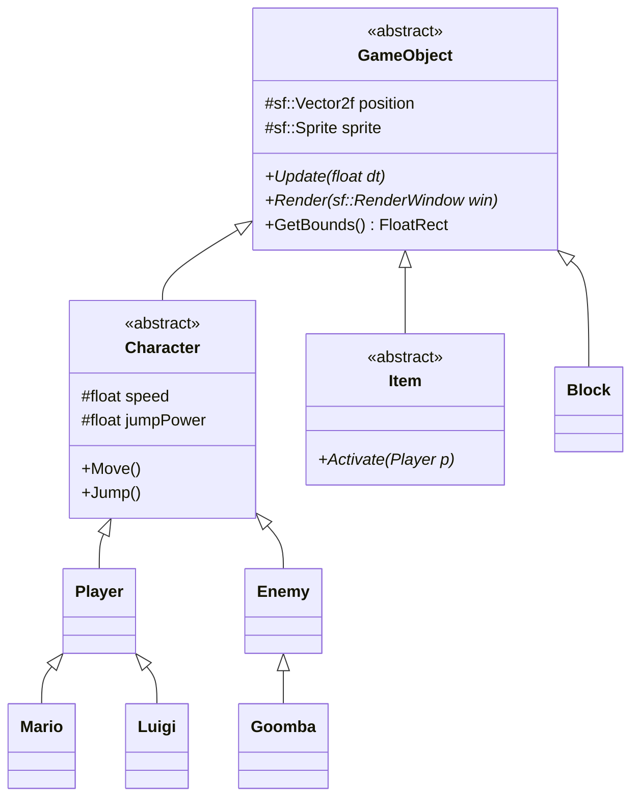

# Proposed Implementation Plan: CS202 Final Project - Super Mario

**Workspace:** `d:\Private Data\D_Downloads\Study\HCMUS\1st Year\Semester 3\Programming Systems\Mario`  
**Reference Document:** `CS202-FinalProject_SuperMario_extracted.md`

---

## 1. Architecture & Design

### 1.1 Core Technologies
*   **Language:** C++17
*   **Graphics & Audio Engine:** SFML (Simple and Fast Multimedia Library) - Highly recommended for OOP-based 2D games.
*   **Physics:** Custom AABB (Axis-Aligned Bounding Box) collision or Box2D (if advanced physics are needed). For a basic Mario clone, custom AABB is usually sufficient and shows better understanding of low-level logic.

### 1.2 OOP Principles & Hierarchy
*   **Encapsulation:** All attributes are `private` or `protected` with `public` getters/setters.
*   **Inheritance & Abstraction:**
    *   `GameObject` (Abstract Base)
        *   `Character` (Base) -> `Player` (`Mario`, `Luigi`), `Enemy` (`Goomba`, `Koopa`).
        *   `Item` (Base) -> `Mushroom`, `Coin`, `FireFlower`.
        *   `Block` (Base) -> `BrickBlock`, `QuestionBlock`.
*   **Polymorphism:** Using `std::vector<GameObject*>` or `std::vector<Character*>` to dynamically call `Update()` and `Draw()` methods on all game entities.

### 1.3 Design Patterns (Target: 5 Patterns)
1.  **Singleton Pattern:** `GameManager` (controls score, lives, current level) and `AssetManager` (loads textures/sounds once to save memory).
2.  **Factory Method Pattern:** `EntityFactory` to spawn specific characters, enemies, and items dynamically based on level data (e.g., parsing a text file).
3.  **State Pattern:** To manage Game States without massive `switch` statements (`MenuState`, `PlayingState`, `PauseState`, `GameOverState`).
4.  **Observer Pattern:** Used for Event Handling (e.g., when Mario collects a coin, the `ScoreObserver` updates the UI, or when Mario dies, the `SoundManager` plays a sound).
5.  **Strategy Pattern (or Command Pattern):** For capturing user inputs or handling different AI movement behaviors (e.g., `PatrolStrategy` for Goomba, `ChaseStrategy` for Koopa).

### 1.4 Features Implementation
*   **Levels:** 3 hardcoded or file-based levels.
*   **Save/Load:** `SaveManager` using `std::fstream` to serialize `GameManager` state (score, lives, level, character unlocked).
*   **Advanced:** 
    *   *AI:* Distance-based checking to trigger `ChaseStrategy`.
    *   *Multiple Characters:* Hotkey to swap `Character* currentPlayer` pointer between a `Mario` instance and a `Luigi` instance.
*   **Bonus (Level Editor):** Mouse-click grid placement system that saves a 2D array to a `.txt` file.

### 1.5 Mermaid Draft (Core Class Diagram)

---

## 2. Task Allocation & Workflow Routing

*   **Task 1: Environment Setup & Foundation** -> Route to `development-workflow`
    *   Set up SFML template.
    *   Implement `AssetManager` (Singleton) and basic Game Loop.
*   **Task 2: Game State Management** -> Route to `development-workflow`
    *   Implement State Pattern (`Menu`, `Play`, `Pause`).
*   **Task 3: Core Entities & Physics** -> Route to `development-workflow`
    *   Implement `GameObject`, `Character`, `Player`, `Enemy`.
    *   Implement AABB Collision detection and Gravity.
*   **Task 4: Factories, Levels & Items** -> Route to `development-workflow`
    *   Implement `EntityFactory`.
    *   Build the 3 levels (using Tilemaps or text parsing).
    *   Implement `Item` inheritance and interactions.
*   **Task 5: Polish & Advanced Features** -> Route to `development-workflow`
    *   Save/Load functionality.
    *   Sound integration (Observer Pattern).
    *   AI tracking and Luigi switching.
*   **Task 6: Documentation & Submission** -> Route to `report-workflow`
    *   Generate Design Document, UML Diagrams, and finalize report.

---

## 3. Potential Risks / Edge Cases
*   **Memory Leaks:** Storing raw pointers in `std::vector<GameObject*>`. *Mitigation:* Must implement safe destructors (`~GameManager`) or use `std::unique_ptr`.
*   **Collision Tunneling:** Moving too fast causes Mario to phase through walls. *Mitigation:* Cap maximum velocity or use swept AABB.
*   **SFML Configuration:** Linking SFML dynamically vs statically can cause issues on different machines. *Mitigation:* Provide a clear `CMakeLists.txt` or Visual Studio `.sln` with local relative linking.

---

**Next Step:** Please reply with "Approve" to begin execution, or provide modifications (e.g., if you want to use SDL instead of SFML, or if you want to focus on the console first).
